# 🌐 Sistem Informasi Geografis Pemetaan Kasus Narkoba Menggunakan Algoritma Ray Casting

Proyek ini merupakan aplikasi **Laravel 12** untuk pemetaan dan analisis kasus penyalahgunaan narkoba di wilayah **Kalimantan Barat**, menggunakan algoritma **Ray Casting** untuk menentukan posisi spasial suatu lokasi terhadap batas wilayah administrasi.

---

## 📸 Cuplikan Tampilan Aplikasi

Berikut urutan tampilan halaman utama hingga fitur analisis dan laporan:

| No | Halaman | Cuplikan |
|----|----------|-----------|
| 1 | Home Page | 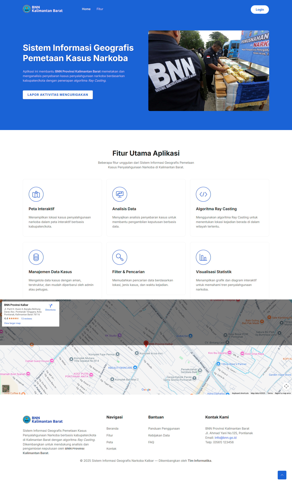 |
| 2 | Report Form |  |
| 3 | Login Admin | 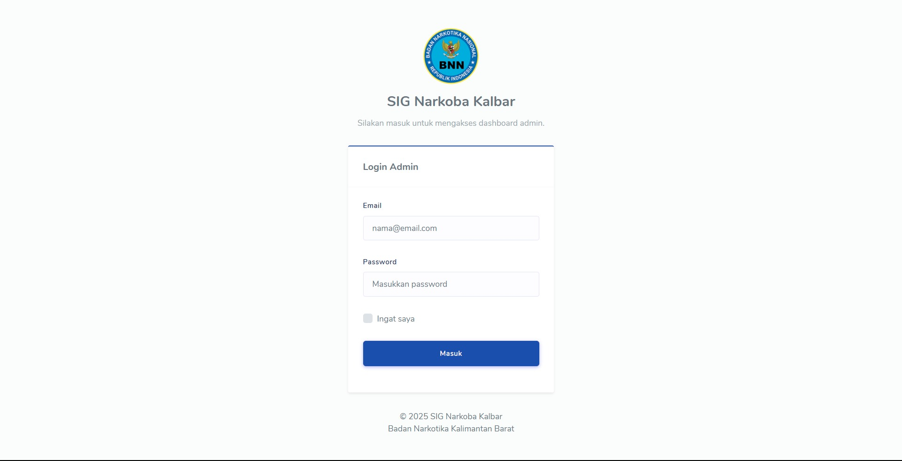 |
| 4 | Dashboard Admin |  |
| 5 | Data Kasus |  |
| 6 | Detail Kasus | 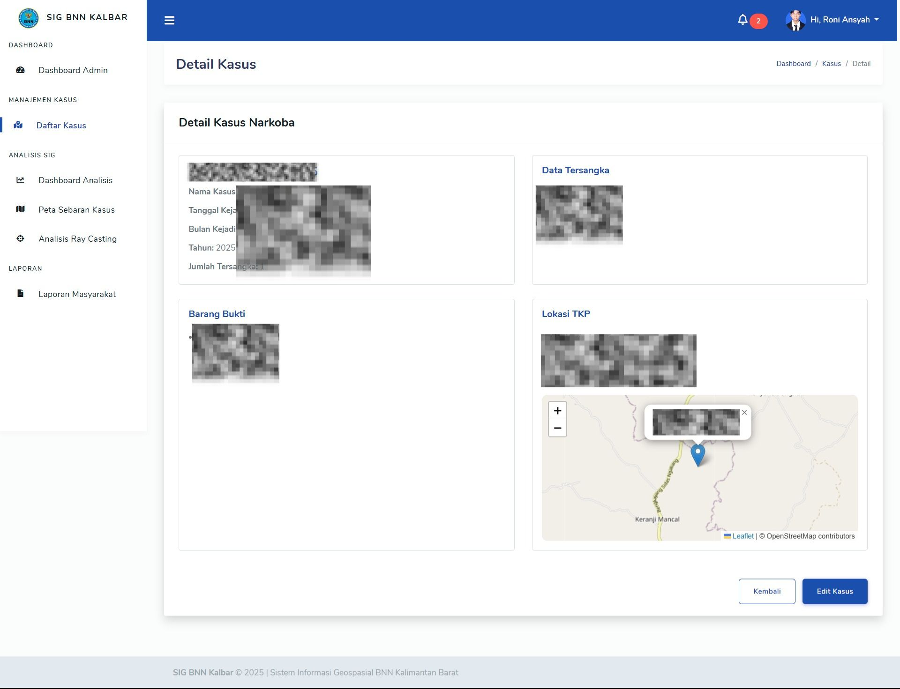 |
| 7 | Edit Kasus | 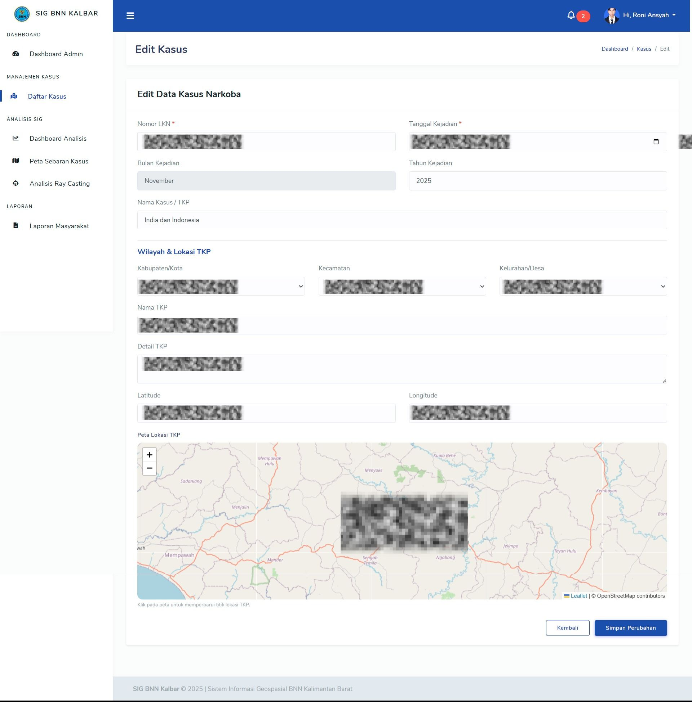 |
| 8 | Create Data Step 1 | 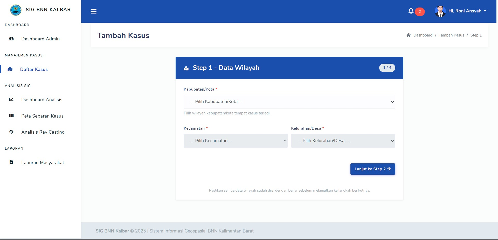 |
| 9 | Create Data Step 2 | 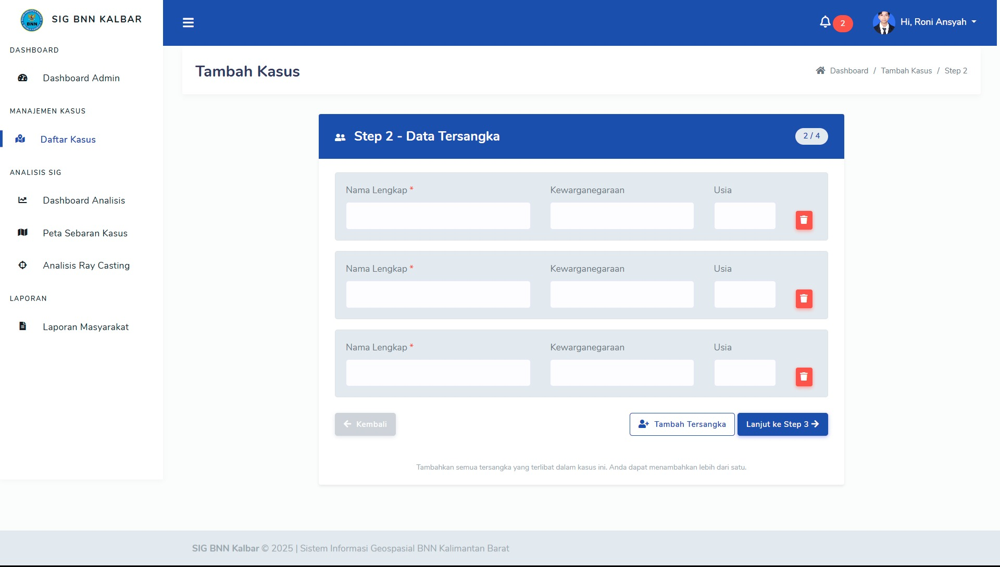 |
| 10 | Create Data Step 3 | 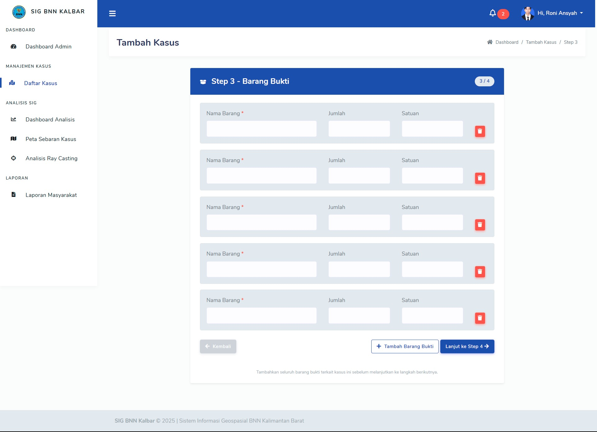 |
| 11 | Create Data Step 4 | 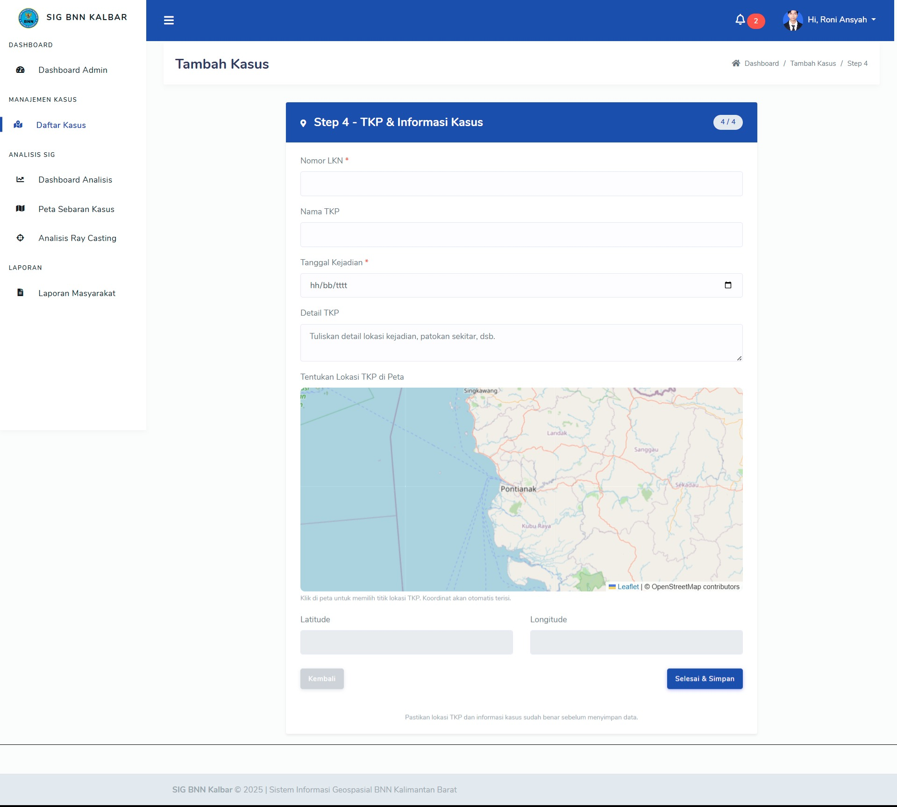 |
| 12 | Analisis Index | 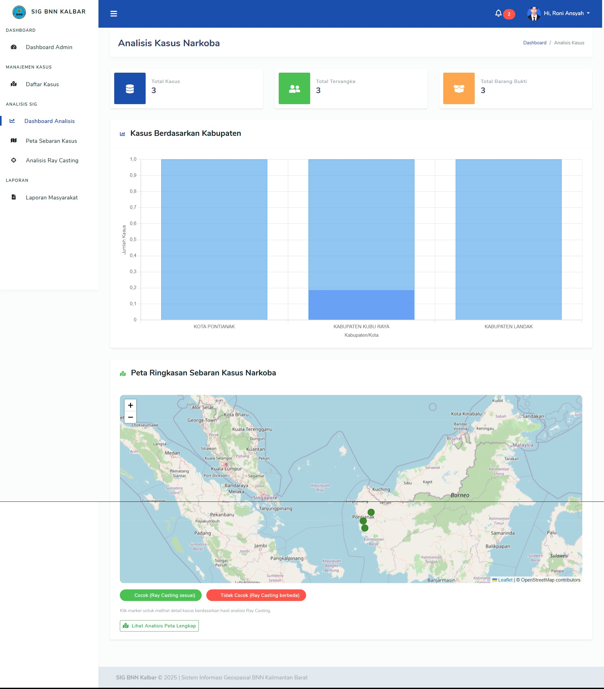 |
| 13 | Ray Casting pada Peta | 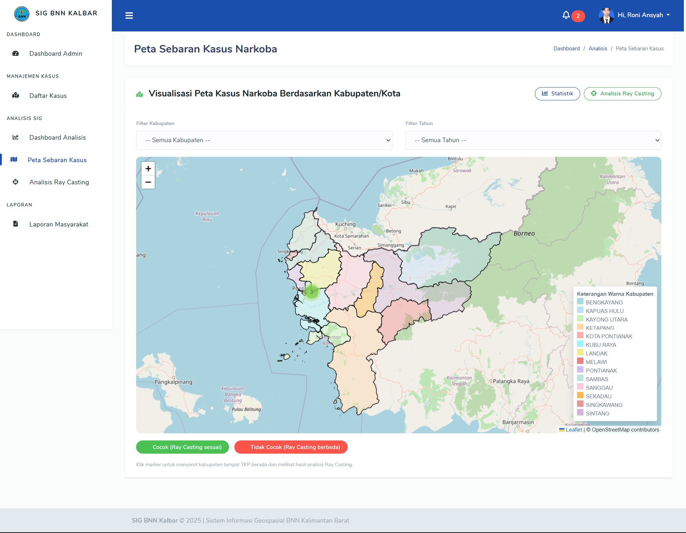 |
| 14 | Analisis Algoritma | 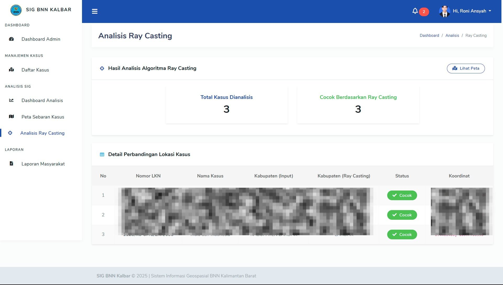 |
| 15 | Laporan |  |
| 16 | Detail Laporan | 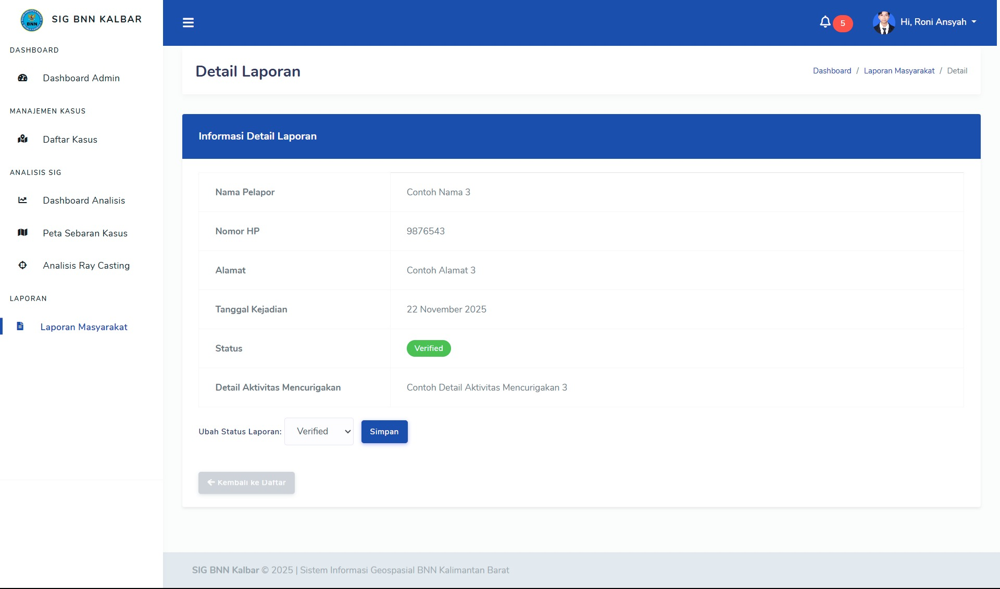 |
| 17 | Edit Profil Admin | 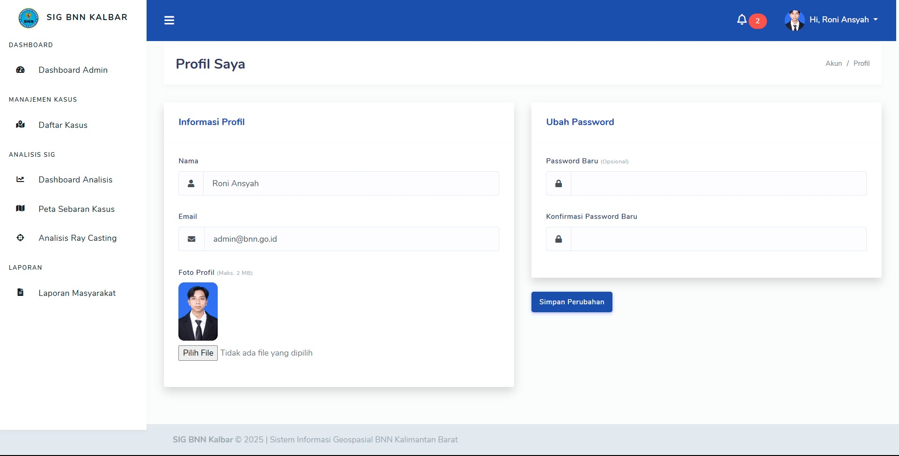 |

---

## 🔒 Akses Source Code

Kode sumber **tidak dipublikasikan secara umum**.  
Untuk mendapatkan akses penuh terhadap source code aplikasi ini, silakan hubungi:

📞 **+62 8xx-xxxx-xxxx**  
📧 **emailkamu@example.com**

---

## 🛠️ Teknologi yang Digunakan

- **Laravel 12 (PHP 8+)**
- **MySQL Database**
- **Leaflet.js** – Peta interaktif
- **Bootstrap 5**
- **AdminLTE**
- **Algoritma Ray Casting**

---

## 🧠 Tentang Algoritma Ray Casting

Algoritma **Ray Casting** digunakan untuk menentukan apakah suatu titik berada di dalam atau di luar area poligon (misalnya batas wilayah administratif).  
Dalam konteks aplikasi ini, algoritma tersebut membantu menentukan **lokasi kasus narkoba** berdasarkan peta digital dan batas wilayah kabupaten/kota.

---

## 👨‍💻 Pengembang

Dikembangkan oleh: **Bos (ronirn)**  
Tahun: **2025**  
Proyek ini dibuat untuk tujuan penelitian dan edukasi dalam bidang **Sistem Informasi Geografis (SIG)** dan **Analisis Spasial**.

---

© 2025 – Sistem Informasi Geografis Pemetaan Kasus Narkoba Menggunakan Algoritma Ray Casting  
Semua hak dilindungi.
